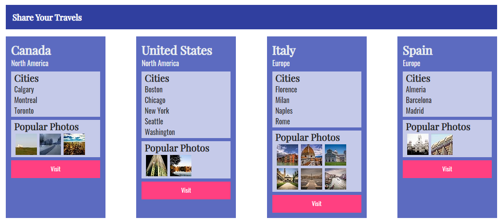
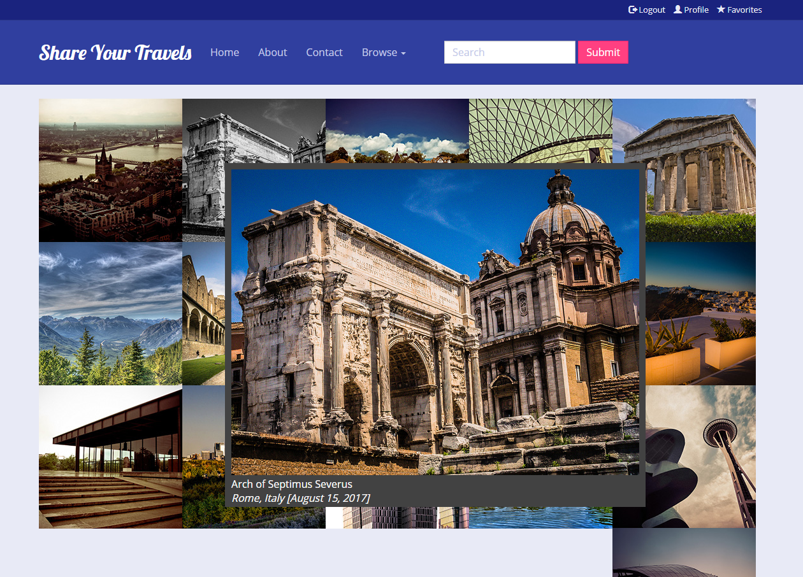
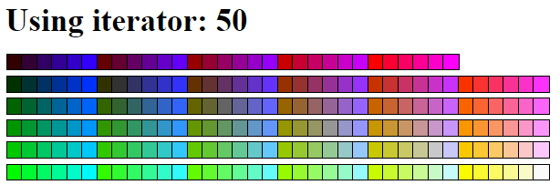
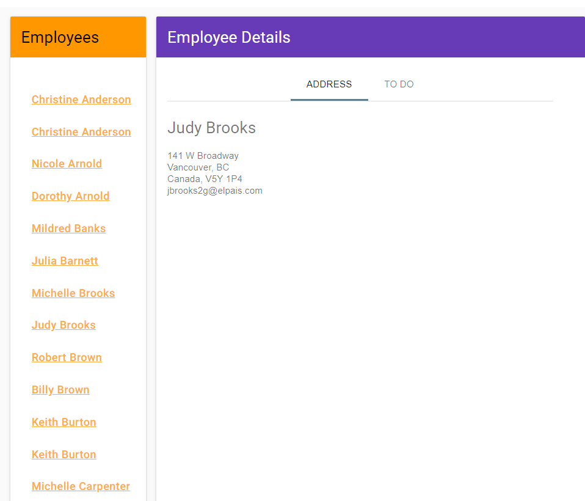

# WebDev
Learning Web Development at CU
Labs are done in a restricted 3 hour time-frame.
## Lab 1
* Using markup to build to replicate a static webpage
* Attempt by me (__LEFT__) | Solution (__RIGHT__)

 

 
## Lab 2
* Use one CSS file to replicate a website given the mark-up
* Attempt by me (__LEFT__) | Solution (__RIGHT__)

 

 
## Assignment 1
* Use one HTML file and one CSS file to build a form page using tables as your frame of refernce to lay everything out
* Use the form methods and redirect your query string to http://www.randyconnolly.com/tests/process.php

 

## Lab 3
* Use JavaScript to populate the respective country information
* Understanding of objects and DOM using JS

 

 
 ## Assignment 2
* Use JQuery and a JSON file to populate the images
* Event-handling to produce a gray-scale image on the hovered image and produce a div with a larger version 

 

 
 ## Lab 4
* Use PHP to create a color palette using an iterator variable
* Use XAMP to create a server st. php can generate the respective html

 

 
 ## Lab 5
 * Use PHP to work with a SQL database (MariaDB)
 * Server created using XAMP 
 
 

 

