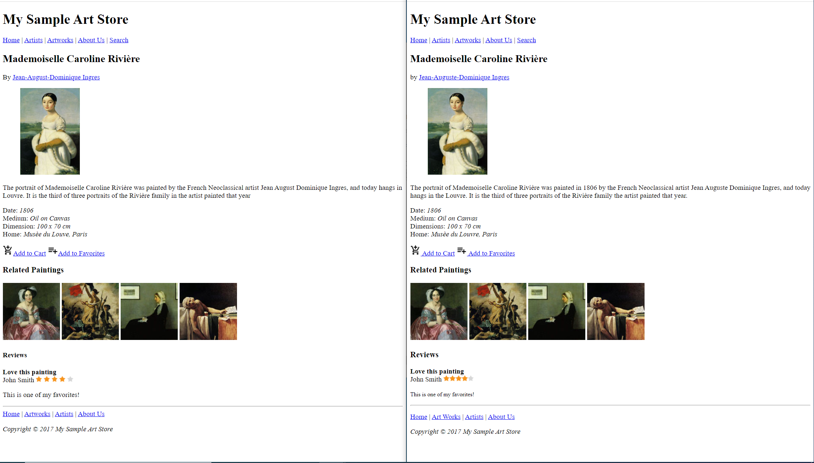
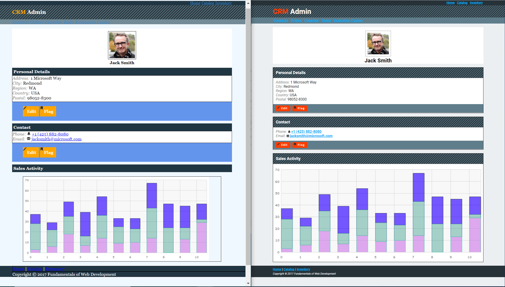
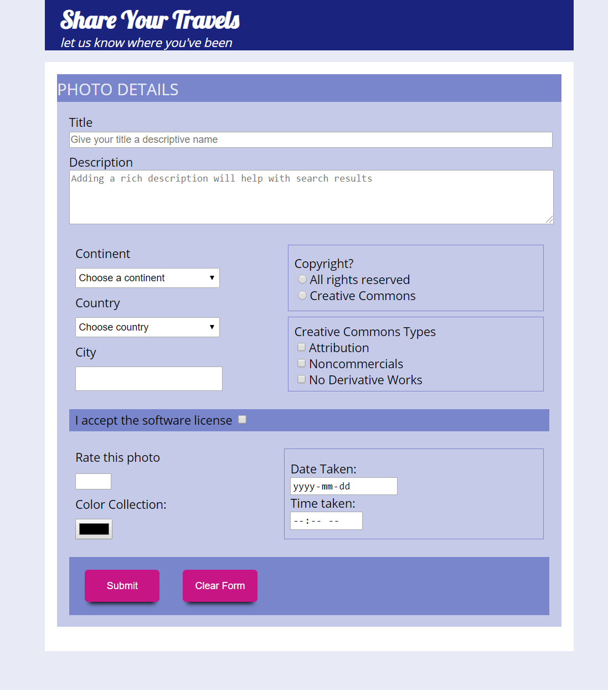

# WebDev
Learning Web Development at CU
Labs are done in a restricted 3 hour time-frame.
## Lab 1
* Using markup to build to replicate a static webpage
* Attempt by me (__LEFT__) | Solution (__RIGHT__)

 

 
## Lab 2
* Use one CSS file to replicate a website given the mark-up
* Attempt by me (__LEFT__) | Solution (__RIGHT__)

 

 
## Assignment 1
* Use one HTML file and one CSS file to build a form page using tables as your frame of refernce to lay everything out
* Use the form methods and redirect your query string to http://www.randyconnolly.com/tests/process.php

 

